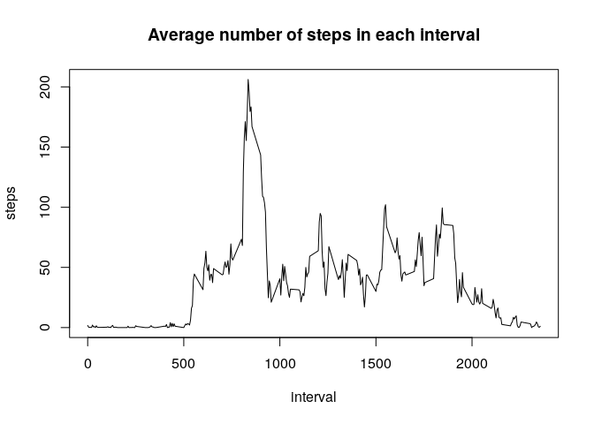
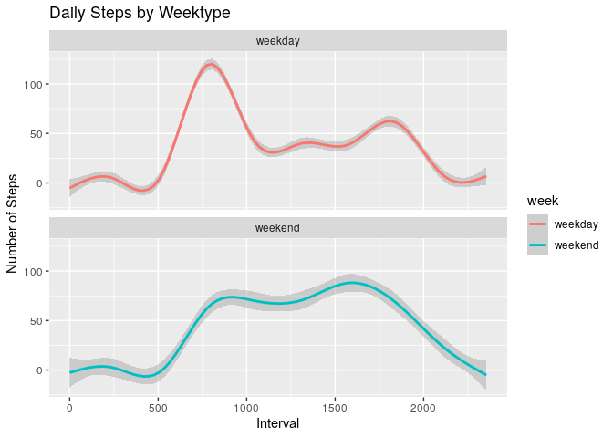

## Loading and preprocessing the data
Load using data.table package.


```r
library(data.table)
x = fread("activity.csv")
str(x)
```

```
## Classes 'data.table' and 'data.frame':	17568 obs. of  3 variables:
##  $ steps   : int  NA NA NA NA NA NA NA NA NA NA ...
##  $ date    : IDate, format: "2012-10-01" "2012-10-01" ...
##  $ interval: int  0 5 10 15 20 25 30 35 40 45 ...
##  - attr(*, ".internal.selfref")=<externalptr>
```


## What is mean total number of steps taken per day?


```r
z = x[, sum(steps, na.rm = TRUE) ,by = date]
hist(z$V1, xlab = "Number of Steps", main = "Number of Steps each day")
```

<!-- -->

```r
cat("The distribution of the number of steps taken each day has mean = ", mean(z$V1),
	" and median = ", median(z$V1), ".\n")
```

```
## The distribution of the number of steps taken each day has mean =  9354.23  and median =  10395 .
```

## What is the average daily activity pattern?


```r
zz = x[, mean(steps, na.rm = TRUE),by = interval]
plot(zz,type="l",ylab = "steps", main = "Average number of steps in each interval")
```

<!-- -->

```r
cat("The 5-minutes interval which contains the maximus number of steps is:", x$interval[which.max(zz$V1)], "\n")
```

```
## The 5-minutes interval which contains the maximus number of steps is: 835
```

## Imputing missing values


```r
cat("The total number of missing values is: ", sum(is.na(x)), ".\n")
```

```
## The total number of missing values is:  2304 .
```

```r
cat("We use the mean of the interval to fill the missing values \n")
```

```
## We use the mean of the interval to fill the missing values
```

```r
setkey(zz,"interval")
setkey(x,"interval")
full = zz[x]
full$steps = as.numeric(full$steps)
full[is.na(steps), steps := V1]
full[,V1:=NULL]

zfull = full[, sum(steps) ,by = date]
hist(zfull$V1, xlab = "Number of Steps", main = "Number of Steps each day")
```

<!-- -->

```r
cat("The distribution of the number of steps taken each day has mean = ",
	mean(zfull$V1), " and median = ", median(zfull$V1), ".\n")
```

```
## The distribution of the number of steps taken each day has mean =  10766.19  and median =  10766.19 .
```
These value differs from the first part of the assignment. The missing data skewed the distribution: in fact, now the median and mean are equal and the distribution is simmetric.

## Are there differences in activity patterns between weekdays and weekends?


```r
full[weekdays(date) %in% c("sabato","domenica"), week := "weekend"]
full[!weekdays(date) %in% c("sabato","domenica"), week := "weekday"]
full$week = as.factor(full$week)

library(ggplot2)
ggplot(full , aes(x = interval , y = steps, color=week))+ 
	geom_smooth() + 
	labs(title = "Daily Steps by Weektype", 
		x = "Interval", y = "Number of Steps") + 
	facet_wrap(~week , ncol = 1, nrow=2)
```

```
## `geom_smooth()` using method = 'gam' and formula 'y ~ s(x, bs = "cs")'
```

<!-- -->

There are clearly different patterns between weekday and weekend as the plots clearly show.
